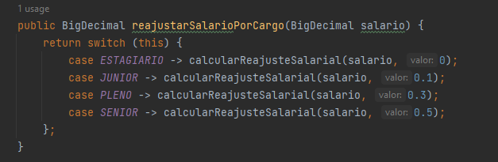

# Projeto Disciplina - Padrões de Projeto e Clean Code

## Padrões de Projeto Utilizados:
### Criacionais
#### - Fábrica Abstrata
#### - Método Fábrica
### Comportamental
#### - 
### Estrutural
#### - Ponte

## SOLID
### S - Principio da Responsabilidade Única
#### Utilizado por exemplo, no agrupamento dos dados de Endereço

### O - Principio Aberto Fechado
#### Utilizado por meio da implementação de interfaces e classes que não deixam que Estagiario tenha salario, e Senior tenha avanço de cargo.

### L - Principio da Substituição de Liskov
##### Utilizado para evitar que Funcionário Terceirizado, apesar de ser um Funcionário, não ter o método reajustarSalário()

### I - Princípio da Segregação da Interface
##### Utilizado para criar interfaces especificas e impedir que uma classe não implemente métodos que não irá utilizar

### D - Princípio da Inversão da Dependência
#### Não identificado para aplicação

### Clean Code e Bad Smells
#### Foram utilizados nomes coesos.
#### Evitado uso de comentários
#### Foi utilizado refatoração de funções, como por exemplo, o switch calcularReajusteSalarial() em Cargo foi removido e utilizado Classes para cada tipo de funcionario, utilizando uma interface de FuncionarioInterno, e uma interface exclusiva para FuncionarioInternoSenior, que não possui avanço de cargo.

#### Utilizado stream do java 8 para utilizar a validação de telefone na Main após criar um funcionario